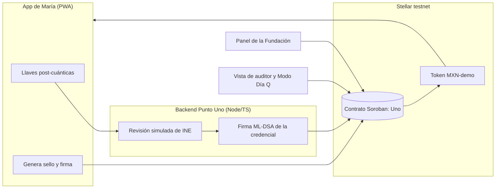

# Uno — Roadmap de ejecución del demo

> Equipo: Uriel Prado (producto, desarrollo, seguridad y pitch) + Claude (mentoría y pair programming).
> Objetivo: un demo funcional en la testnet de Stellar para el Demo Day.

---

## 1. Cómo se usa Uno (la historia del demo)

Personajes ficticios del demo:

- **María**, beneficiaria.
- **Punto Uno**, un local de verificación presencial (como los locales de World, pero sin orbe).
- **Fundación Raíces**, que reparte un apoyo escolar de $1,000 a 500 personas.
- **Un atacante**, que tiene una copia de la INE de María.

| Paso | Qué pasa (para contarlo) | Qué pasa por dentro |
|---|---|---|
| 1. Descarga | María abre la app Uno. La app le crea una "llave" que solo existe en su celular. | Se genera un par de llaves post-cuánticas en el dispositivo. La llave privada nunca sale del celular. |
| 2. Verificación única | María va a un Punto Uno con su INE. El operador confirma que es ella, en persona, y que no se había registrado antes. | El backend del verificador calcula una **huella de unicidad** a partir de la CURP y revisa en Stellar que no exista. |
| 3. Credencial | El operador aprueba y María recibe su credencial en el celular. Sus datos se borran del Punto Uno. | El verificador firma la credencial con **ML-DSA (FIPS 204)**. En Stellar solo queda: huella de unicidad + llave pública de María + quién la verificó + estado "activa". Ningún nombre, CURP ni foto. |
| 4. Programa | La Fundación crea su programa en Uno: "Apoyo escolar, $1,000, 500 lugares" y deposita los fondos. | La organización llama al contrato `create_program` y deposita el token del demo en el contrato. |
| 5. Cobro | María escanea el QR del programa y toca "Reclamar". En segundos le llegan $1,000. | La app genera un **sello** = hash(secreto de María + id del programa) y lo firma. El contrato verifica: credencial activa, firma válida y sello no usado; entonces paga. |
| 6. Doble cobro | María intenta cobrar otra vez: **rechazado**. | El sello de ese programa ya está marcado como usado. |
| 7. Suplantación | El atacante tiene la INE de María, pero no su celular: **rechazado**. | Sin la llave privada no puede generar una firma válida. |
| 8. Modo Día Q | Simulamos que una computadora cuántica rompe la criptografía clásica. Una identidad con firma clásica es suplantada; la de María, no. | La credencial clásica (Ed25519) se falsifica en la simulación; la post-cuántica rechaza la firma falsa. |
| 9. Auditoría | La Fundación ve: 500 pagos a 500 personas únicas, cero datos personales guardados. Cualquier auditor lo comprueba en el explorador de Stellar. | Lectura pública de eventos del contrato. |

**Si María pierde su celular:** regresa a un Punto Uno, se verifica otra vez, la credencial anterior se revoca y la nueva queda ligada a la misma huella de unicidad.

**La frase para explicarlo:** *"En World escaneabas tu iris para demostrar que eres humano. En Uno te verificas una sola vez en persona, tu prueba vive en tu celular y nadie se queda con tu cara. Y está protegida contra las computadoras cuánticas."*

---

## 2. Arquitectura

| Capa | Tecnología | Responsabilidad |
|---|---|---|
| Contrato | Rust + Soroban SDK + `stellar-cli` | Registro de verificadores y credenciales, programas, sellos usados, pagos |
| Backend | Node.js + TypeScript + `@stellar/stellar-sdk` + `@noble/post-quantum` | Simular el Punto Uno, firmar credenciales, patrocinar comisiones (fee sponsorship) |
| Frontend | React (Vite) + Tailwind, como PWA | 4 vistas: App ciudadano, Panel Punto Uno, Panel Fundación, Auditor/Día Q |
| Token | Activo de Stellar emitido por nosotros: `MXN-demo` | Simular pesos digitales en testnet |
| Datos | Sin base de datos con datos personales | Lo único persistente vive en Stellar y en el celular |

### Funciones del contrato (MVP)

| Función | Quién la llama | Qué hace |
|---|---|---|
| `init(admin)` | Admin | Configura el contrato |
| `add_verifier(pubkey)` / `remove_verifier` | Admin | Autoriza o retira un Punto Uno |
| `issue(credential, verifier_sig)` | Backend del verificador | Registra huella de unicidad + llave pública del titular; rechaza si la huella ya existe |
| `revoke(credential_id)` | Verificador | Revoca una credencial (celular perdido o fraude) |
| `create_program(org, token, amount, max_claims)` | Organización | Crea un programa y recibe los fondos |
| `claim(program_id, credential_id, seal, signature, payout)` | App del ciudadano (vía backend que paga la comisión) | Verifica y paga; marca el sello como usado |
| `stats(program_id)` | Cualquiera | Pagos realizados, fondos restantes |

---

## 3. Decisión técnica clave: verificación post-cuántica

Se resuelve en un **spike de 1 día** al inicio de la Semana 3.

| Opción | Cómo | Cuándo usarla |
|---|---|---|
| **A** | Funciones nativas de verificación post-cuántica en Soroban (Plan de Preparación Cuántica de Stellar, etapa 1) | Si ya están disponibles en testnet |
| **B** | Firmas basadas en hash (WOTS/Lamport) verificadas en el contrato con SHA-256, que Soroban ya tiene | Si A no está disponible y cabe en el presupuesto de cómputo |
| **C** | Firma híbrida: Ed25519 verificada en la cadena + ML-DSA verificada por el backend, que deja constancia en el contrato | Plan de respaldo para no frenar el demo |

**Criterio:** la opción más alta en la tabla que funcione en testnet dentro del límite de cómputo de una transacción. Se documenta en `docs/decisiones/ADR-001-firmas-pq.md`.

---

## 4. Seguridad

### Modelo de amenazas

| Amenaza | Ejemplo | Mitigación |
|---|---|---|
| Doble registro (Sybil) | Una persona saca dos credenciales | Huella de unicidad única por persona en el contrato |
| Doble cobro | Cobrar dos veces el mismo programa | Sello por programa marcado como usado |
| Suplantación | Alguien con la INE de María intenta cobrar | Se exige firma con la llave que solo vive en su celular |
| Repetición (replay) | Reenviar una firma válida para cobrar a otra cuenta | La firma cubre id del programa + sello + cuenta de pago |
| Verificador corrupto | Un Punto Uno emite credenciales falsas | Cada credencial registra quién la emitió; revocación masiva por verificador |
| Robo del celular | Usan la app de María | Desbloqueo local (PIN o biometría del sistema) + revocación |
| Ataque a la huella de unicidad | Intentar adivinar CURPs para saber quién está registrado | La huella usa un secreto del sistema (HMAC), no un hash simple de la CURP; en el MVP, el secreto vive en el backend del verificador |
| Cosecha ahora, descifra después | Guardar datos hoy y romperlos con computación cuántica | Firmas post-cuánticas y cero datos personales en la cadena |
| Fuga de secretos | Llaves en el repo | `.env` fuera de git, revisión con `gitleaks` antes de cada entrega |

### Checklist antes del Demo Day

- [ ] Ningún dato personal en la cadena, en los logs ni en el repo
- [ ] Pruebas negativas del contrato: doble registro, doble cobro, firma inválida, credencial revocada, verificador no autorizado
- [ ] Llaves del verificador y del admin fuera del repo
- [ ] Dependencias revisadas (`cargo audit`, `npm audit`)
- [ ] Limitaciones documentadas con honestidad: privacidad entre programas (requiere ZK post-cuántico) y el secreto de la huella centralizado en el MVP

---

## 5. Plan por semanas

> Fechas tentativas; ajustar al calendario oficial del bootcamp y a la fecha del Demo Day.

### Semana 2 (hasta el 4 de octubre): definición

- [x] Problem Brief (`docs/semana1/`)
- [ ] Entregable 2: Product Blueprint
- [ ] Este roadmap en el repo

### Semana 3 (5–11 de octubre): el corazón funcionando

| Día | Tarea | Hito |
|---|---|---|
| 1 | Entorno: Rust, `stellar-cli`, Node, Freighter; cuentas de testnet con Friendbot; emitir `MXN-demo` | "Hola mundo" desplegado en testnet |
| 2 | Spike de firmas post-cuánticas → ADR-001 | Opción A, B o C elegida |
| 3–5 | Contrato v0: verificadores, credenciales, programas, `claim`, con pruebas unitarias | Pruebas en verde |
| 6–7 | Scripts de terminal que corren las escenas 2 a 7 contra testnet | **Flujo completo por terminal, sin interfaz** |

### Semana 4 (12–18 de octubre): producto en el navegador

| Días | Tarea | Hito |
|---|---|---|
| 1–2 | Backend del Punto Uno: emisión de credenciales firmadas y patrocinio de comisiones | API funcionando |
| 3–5 | Frontend: App ciudadano (llaves, credencial, reclamar), Panel Punto Uno, Panel Fundación | Las 3 vistas conectadas |
| 6–7 | Vista de auditor + integración de punta a punta | **Demo completo en el navegador, aunque feo** |

### Semana 5 (19–25 de octubre): seguridad, Día Q y pitch

| Días | Tarea | Hito |
|---|---|---|
| 1–2 | Revisión de seguridad con el checklist + pruebas negativas | Checklist completo |
| 3 | Modo Día Q | Escena 8 funcionando |
| 4 | Pulir UI y textos; **congelar features** | Nada nuevo a partir de aquí |
| 5 | Grabar video de respaldo del demo (plan B si falla la red) | Video listo |
| 6–7 | Guion del pitch y ensayos cronometrados | Pitch de 3–5 minutos ensayado |

---

## 6. Fuera del alcance del MVP

- Verificación real de INE contra RENAPO o biometría real (se simula).
- Privacidad total entre programas con pruebas de conocimiento cero post-cuánticas.
- App nativa (se usa una PWA).
- Mainnet y dinero real.
