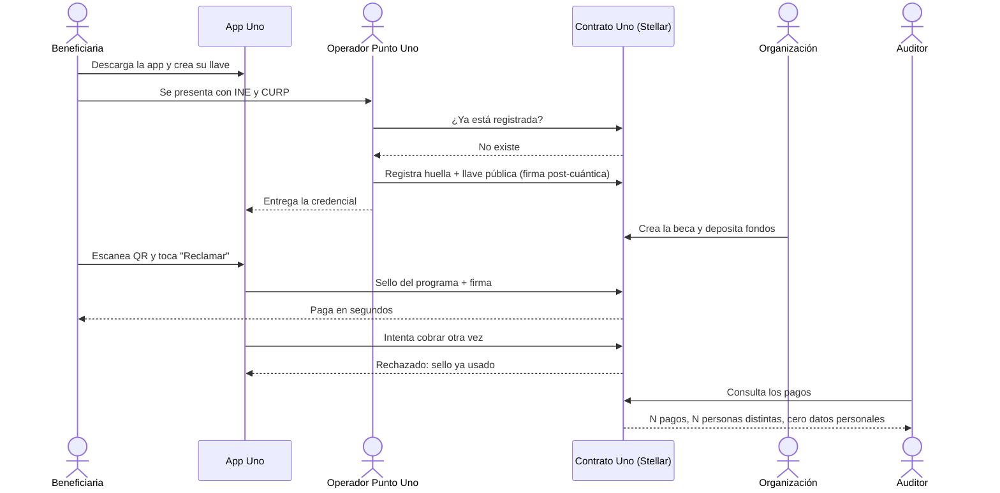
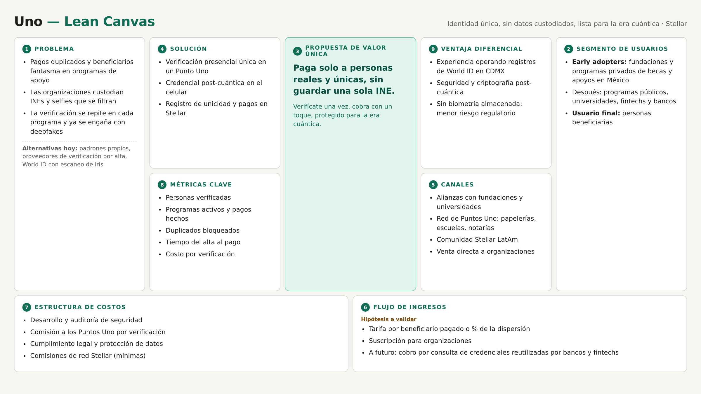
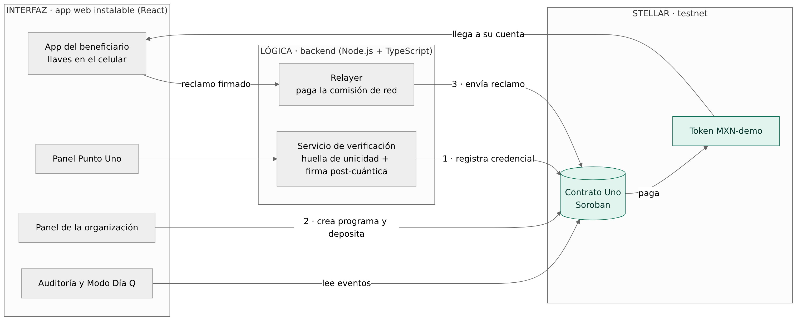

# Product Blueprint

**Nombre del proyecto:** Uno: prueba de que eres una persona real y única, sin entregar tu identidad a cada organización.

**Repositorio (enlace obligatorio):** [Repositorio de Uno](https://github.com/USUARIO/REPO)

> Los campos marcados como *enlace obligatorio* deben ir como enlace en Markdown, con este formato: `[texto del enlace](https://...)`. Reemplacen el texto y la dirección de ejemplo.

---

## Contenido

1. Priorización de historias
2. Propuesta de valor
3. Flujo de usuario
4. Alcance del MVP
5. Lean Canvas
6. Backlog priorizado (Kanban)
7. Arquitectura inicial
8. Uso de Stellar y justificación

---

## 1. Priorización de historias

> Historias elegidas entre las que propuso el equipo y criterio con que se priorizaron. Son las que pasan al backlog. Extensión: breve.

**Criterio de priorización:** imprescindible / debería / podría / queda fuera. Dentro de cada nivel, ordenamos por (1) valor para quien paga, (2) si es indispensable para mostrar el flujo completo en el demo y (3) riesgo técnico: lo más incierto se construye primero. Historias propuestas en [`Uriel.md`](Uriel.md) (modalidad individual).

| Prioridad | Historia | Propuesta por | Por qué entra al backlog |
| :---: | --- | :---: | --- |
| 1 | Como coordinadora de un programa de becas quiero pagar solo a personas que demostraron ser reales y únicas para no perder fondos en cobros duplicados o beneficiarios fantasma. | Uriel Prado | **Imprescindible.** Es el valor central para quien paga y adopta. |
| 2 | Como beneficiario quiero verificarme una sola vez en persona y guardar mi credencial en mi celular para no entregar mi INE y mi CURP a cada programa. | Uriel Prado | **Imprescindible.** Sin credencial no hay forma de demostrar unicidad. |
| 3 | Como operador de un Punto Uno quiero saber en segundos si una persona ya tiene credencial para no emitir dos credenciales a la misma persona. | Uriel Prado | **Imprescindible.** Garantiza la unicidad desde el registro. |
| 4 | Como beneficiario quiero reclamar un apoyo desde mi celular y recibir el dinero en minutos para no esperar semanas ni hacer filas. | Uriel Prado | **Imprescindible.** Cierra el flujo de punta a punta con un pago en Stellar. |
| 5 | Como beneficiario quiero que nadie pueda cobrar a mi nombre aunque tenga una copia de mi INE para estar protegido contra la suplantación. | Uriel Prado | **Imprescindible.** Es la diferencia frente a un padrón tradicional. |
| 6 | Como responsable de seguridad quiero que las credenciales estén firmadas con criptografía post-cuántica para que sigan siendo confiables en la era cuántica. | Uriel Prado | **Imprescindible por riesgo:** es el diferenciador y lo más incierto técnicamente; se valida con un spike al inicio. |
| 7 | Como auditor quiero comprobar que cada pago llegó a una persona distinta sin ver datos personales para revisar los recursos sin exponer a nadie. | Uriel Prado | **Debería.** Aporta confianza y es de bajo costo: el registro ya es público. |

---

## 2. Propuesta de valor

> Qué resultado obtiene el usuario y por qué elegiría esta solución. En qué se diferencia de cómo resuelve hoy. Conecta con el usuario del Problem Brief. Extensión: 150–300 palabras en total.

**Usuario (del Problem Brief):** la coordinadora de un programa que entrega dinero o beneficios (becas, apoyos, incentivos) a cientos o miles de personas. Usuario secundario: la persona beneficiaria.

**Resultado que obtiene:** cada peso llega a una persona real y distinta, **sin que la organización reciba ni guarde una sola copia de INE**. Abre un programa, deposita los fondos y Uno solo paga a quien demuestra ser único. El beneficiario se verifica una sola vez en persona, sin escanear su iris, y después cobra cualquier apoyo con un toque desde su celular, en minutos.

**Por qué elegiría esta solución:** porque reduce las pérdidas por duplicados, elimina el riesgo legal de custodiar datos sensibles y acelera el pago, sin pedirle al beneficiario nada más que su celular. Además, la credencial está firmada con criptografía post-cuántica (NIST FIPS 204), así que no caduca cuando las computadoras cuánticas rompan la criptografía actual.

**En qué se diferencia de cómo lo resuelve hoy:**

| Hoy | Con Uno |
|---|---|
| Cada organización pide la identidad completa | La persona se verifica una vez y reutiliza la prueba |
| Los duplicados solo se detectan dentro del padrón propio | Un registro compartido detecta duplicados entre todos los programas |
| La organización guarda INEs y selfies | En la red solo hay huellas sin nombre |
| Con la INE de otra persona se puede cobrar | Sin el celular y la llave de la persona no se puede cobrar |
| World exige escanear el iris y ha sido suspendido en varios países | Verificación presencial sin biometría almacenada |

---

## 3. Flujo de usuario

> Recorrido de la persona por la solución de principio a fin, roles y puntos de interacción. Diagrama o secuencia numerada. Extensión: 150–300 palabras.

| Paso | Rol | Qué hace | Punto de interacción |
| :---: | :---: | --- | --- |
| 1 | Beneficiario | Descarga la app; su celular crea su llave privada, que nunca sale del dispositivo. | App Uno (celular) |
| 2 | Operador | Revisa en persona la INE y la CURP del beneficiario. | Panel Punto Uno |
| 3 | Operador | El sistema busca la huella de unicidad en Stellar; si ya existe, se rechaza. | Panel Punto Uno → red Stellar |
| 4 | Operador | Aprueba: la credencial se firma y se registra en Stellar sin datos personales. Los datos de la INE se borran. | Panel Punto Uno → contrato Uno |
| 5 | Organización | Crea la beca y deposita los fondos en el contrato. | Panel de la organización → contrato Uno |
| 6 | Beneficiario | Escanea el QR de la beca y toca "Reclamar"; su app firma la solicitud. | App Uno → relayer → contrato Uno |
| 7 | Beneficiario | Recibe el pago en segundos. | App Uno (saldo) |
| 8 | Atacante | Un segundo cobro, o alguien con la INE pero sin el celular, es rechazado. | Contrato Uno |
| 9 | Auditor | Comprueba que cada pago fue a una persona distinta, sin ver datos personales. | Vista de auditoría / explorador de Stellar |

---

## 4. Alcance del MVP

> Funcionalidad central separada de la deseable que queda fuera. Justificación de por qué el recorte sigue entregando valor. Extensión: 150–300 palabras en total.

| Dentro del MVP (funcionalidad central) | Fuera del MVP (deseable, para después) |
| --- | --- |
| App del beneficiario: llave, credencial y reclamo de apoyos | App nativa Android/iOS (se usa una app web instalable) |
| Panel del Punto Uno con verificación **simulada** de INE | Validación real contra RENAPO y lectura de INE |
| Contrato en Soroban: verificadores, credenciales, programas, sellos y pagos | Privacidad total entre programas con pruebas de conocimiento cero post-cuánticas |
| Detección de duplicados en el registro y en el cobro | Credencial reutilizable en bancos y fintechs |
| Firmas post-cuánticas en la credencial y en el reclamo | Atributos firmados adicionales, como "mayor de 18" |
| Revocación de credenciales (celular perdido o verificador comprometido) | Red real de Puntos Uno y su modelo de comisiones |
| Panel de la organización, vista de auditoría y "Modo Día Q" | Mainnet, dinero real y stablecoin en pesos |

**Por qué el recorte sigue entregando valor:** el MVP demuestra completas las tres promesas del producto: **unicidad** (nadie se registra ni cobra dos veces), **cero datos custodiados** (en Stellar no hay nombres ni INEs) y **resistencia cuántica** (la credencial no se puede falsificar ni en el escenario del Día Q). Lo que queda fuera son integraciones y mejoras de escala que no cambian el mecanismo central: simular la revisión de la INE no le quita validez a la prueba, porque lo que evaluamos es lo que pasa *después*. La privacidad con conocimiento cero queda fuera a propósito: las pruebas disponibles hoy en Stellar usan curvas elípticas, que una computadora cuántica también rompería.

---

## 5. Lean Canvas

> Lienzo de una página con el modelo del producto. Extensión: enlace (obligatorio).

**Enlace al Lean Canvas (obligatorio):** [Lean Canvas de Uno](https://github.com/USUARIO/REPO/blob/main/docs/semana2/lean-canvas.png)

El lienzo cubre: problema, segmento de usuarios, propuesta de valor única, solución, canales, métricas clave, ventaja diferencial y estructura de costos e ingresos.

---

## 6. Backlog priorizado (Kanban)

> Enlace al tablero en GitHub Projects, construido con las historias priorizadas, en columnas y con criterios de aceptación por tarjeta. Extensión: enlace al tablero (obligatorio).

**Enlace al tablero (obligatorio):** [Tablero Kanban de Uno en GitHub Projects](https://github.com/users/USUARIO/projects/1)

---

## 7. Arquitectura inicial

> Cómo se conectan las partes (interfaz, lógica, Stellar) y en qué punto entra la red. Diagrama simple en imagen. Extensión: 150–300 palabras en total.

**Diagrama (imagen o enlace):**

| Capa | Componente | Qué hace |
| :---: | --- | --- |
| Interfaz | App web instalable (React) con cuatro vistas: beneficiario, Punto Uno, organización y auditoría | El beneficiario genera y guarda sus llaves en el dispositivo; nunca las envía a un servidor. Las demás vistas operan el flujo de cada rol. |
| Lógica | Servicio de verificación (Node.js + TypeScript) | Calcula la huella de unicidad con un secreto del sistema (para que nadie pueda adivinarla a partir de una CURP) y firma la credencial con criptografía post-cuántica. |
| Lógica | Relayer | Envía a Stellar los reclamos que firma el beneficiario y paga la comisión de red, para que la persona no necesite criptomonedas. |
| Stellar | Contrato Uno (Soroban) | Guarda verificadores, credenciales, programas y sellos usados; decide si un reclamo se paga o se rechaza. |
| Stellar | Token `MXN-demo` | Simula pesos digitales en testnet para fondear programas y pagar. |

**En qué punto entra la red:** Stellar entra en tres momentos: (1) cuando se **registra** una credencial, (2) cuando una organización **crea un programa** y deposita fondos, y (3) cuando el beneficiario **reclama** su apoyo. En los tres, la decisión la toma el contrato, no nuestros servidores: el backend solo transporta datos firmados y no puede aprobar un pago por su cuenta. Las lecturas (auditoría y estado de programas) se hacen directo contra la red. No existe una base de datos con datos personales: lo único persistente vive en el celular del beneficiario y en Stellar.

---

## 8. Uso de Stellar y justificación

> Qué componentes de Stellar usaría y por qué cada uno. Apoyado en el criterio de pertinencia del Problem Brief. Extensión: 150–300 palabras en total.

**Criterio de pertinencia (del Problem Brief):** cumple los tres criterios de la Sesión 1. (1) Organizaciones que no confían entre sí comparten un registro para saber si alguien ya cobró, sin ver quién es ni ser dueñas de la base. (2) El histórico no puede alterarse: un sello usado o una revocación no se pueden borrar. (3) Se elimina el intermediario que concentra la confianza: nadie guarda la identidad de todos.

| Componente de Stellar | Para qué lo usamos | Por qué ese y no otra alternativa |
| --- | --- | --- |
| Contratos Soroban (Rust) | Reglas de registro, unicidad, programas y pagos | Las aplica código que ningún participante controla, ni nosotros |
| Almacenamiento y eventos del contrato | Huellas, sellos usados, revocaciones e historial de pagos | Registro compartido e inalterable que cualquier auditor consulta |
| Activos de Stellar + Stellar Asset Contract | Token `MXN-demo` para fondear y pagar | Pagos nativos de centavos; en producción, una stablecoin en pesos |
| SHA-256 del host | Huellas de unicidad y sellos por programa | El hash se considera seguro frente a computadoras cuánticas |
| Llaves de firma separadas de la cuenta | Agregar firmantes post-cuánticos | Stellar planea verificar firmas post-cuánticas en Soroban (Plan de Preparación Cuántica, junio 2026) |
| Comisión patrocinada (fee bump) | El relayer paga la comisión del reclamo | El beneficiario no necesita XLM |
| Testnet y Friendbot | Cuentas y fondos de prueba | Demo sin dinero real |

**Por qué Stellar:** el producto termina en un **pago**, y Stellar está hecha para pagos baratos y rápidos en moneda local. Además, tiene un plan público y calendarizado para migrar a criptografía post-cuántica, que es justo la promesa de Uno.
